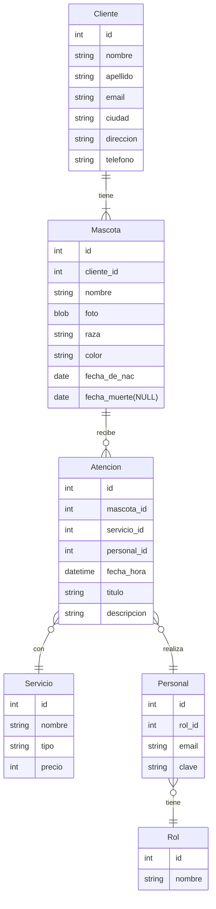

# Página de la veterinaria

### Integrantes

| Legajo |      Apellido y Nombre      |
| :----: | :-------------------------: |
| 51657  | Quagliardi, Martín Nicolás. |
| 51079  |  Regodesebes, Mateo Ariel   |
| 48128  |       Socolsky, José        |
| 51415  |   Alesandroni, Valentino    |

## Introducción

Este repositorio contiene el trabajo relacionado con la página web de la veterinaria del Grupo 10, desarrollado para la materia electiva "Entornos Gráficos" de la Universidad Tecnológica Nacional, Facultad Regional Rosario (UTN-FRRO).

Los profesores responsables de esta materia son:

-   Teoría: Daniela Díaz
-   Práctica: Julián Butti

### Tecnologias utilizadas

El sitio web fue realizado usando:

-   HTML
-   CSS
-   PHP

## Diagrama Entidad-Relación (DER/ERD)

